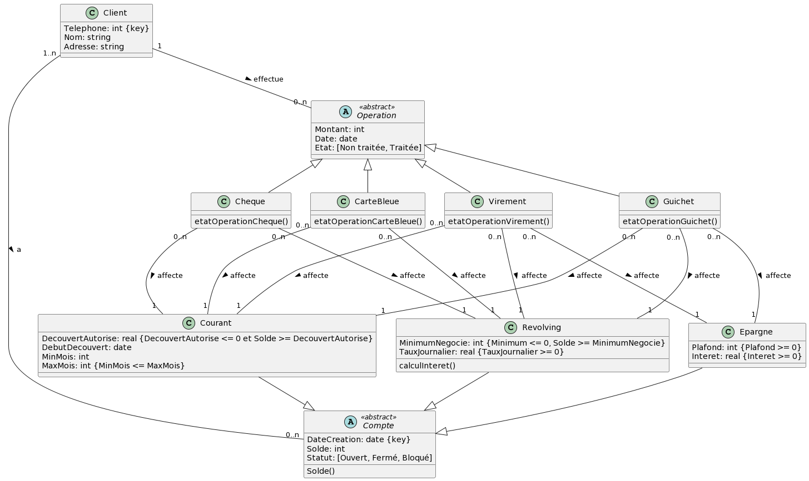

# NF18 Gestion comptes bancaires

## Préambule

Ce projet a été réalisé par Chloé Gommard, Philippe Lefevbre, Léo Péron dans le cadre de l'UV NF18 lors du semestre P22. Il a pour but d'introduire la notion de conception et d'utilisation de BDD relationnel et non relationnel.

Les différentes technologies utilisées pour ce projet sont:
 - Plantuml pour la conception du MCD.
 - Postgresql pour la conception BDD.
 - Python pour le rendu applicatif

## Gestion de comptes bancaires 

Le sujet porte sur la conception d'un système de gestion de compte bancaires avec différentes fonctionnalités.
- Mise en place de différents types de comptes ayant chacun leur spécificité 
- Mise en place de différents types d'opérations ayant chacune leur spécificité
- Mise en place de gestion des utilisateurs et des relations entre utilisateurs/comptes/opérations

## How to run

### Mise en place de la BDD.

Il faut executer le contenu du [script SQL](bdd.sql) sous Postgresql.

### Executer l'applicatif

- Remplir les différents paramètres dans le [fichier config](db_config.json)
- Executer [main.py](main.py)
